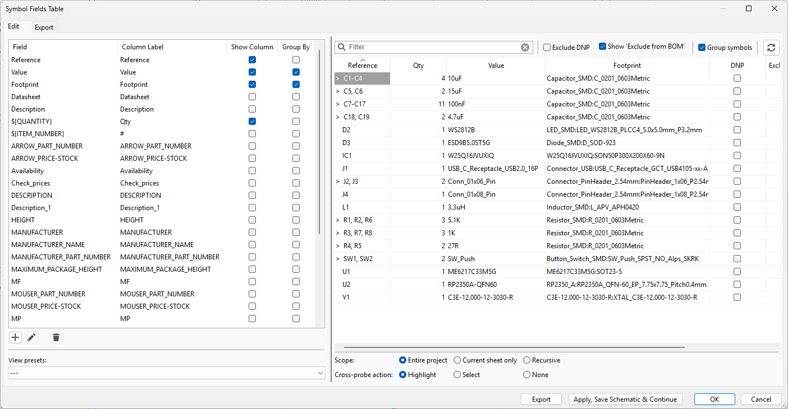

# สอบปฏิบัติ: การออกแบบวงจร PCB ด้วย KiCad
## วิชา: การออกแบบ PCB ด้วย KiCad  
**ชื่อ:** ___________________________  **รหัสนักศึกษา:** ___________________________  
**สาขา:** CE6841/21  **วันที่:** 4 มีนาคม 2026  **เวลา: 3 ชั่วโมง  คะแนนเต็ม: 30 คะแนน**

---

> ## คำชี้แจงการสอบปฏิบัติ
> 1. ให้นักศึกษาสร้างโครงการ KiCad ใหม่ ตั้งชื่อว่า **`StudentID_Exam`** เช่น `Phoori_Exam`
> 2. ออกแบบ **Schematic** และ **PCB Layout** ตามข้อกำหนดในแต่ละงาน
> 3. ต้องผ่าน **ERC และ DRC โดยไม่มี Error** ก่อนส่งงาน
> 4. ส่งไฟล์ทั้ง **Zip Folder** และ **Screenshot** ทั้งหมดตามที่กำหนด
> 5. **ห้าม** Copy ไฟล์จากโครงการตัวอย่าง ต้องวาดและต่อวงจรเองทั้งหมด

---

## ก่อนเริ่มสอบ: โหลด Symbol และ Footprint Library

> ⚠️ **อุปกรณ์บางตัวไม่มีใน KiCad Library มาตรฐาน ต้องโหลดเพิ่มก่อนเริ่มทำข้อสอบ**

### ขั้นตอนที่ 1 – ดาวน์โหลด Library Files

เข้าลิงก์ด้านล่าง แล้วดาวน์โหลดไฟล์ทั้งหมดในโฟลเดอร์:

**📁 [Library Files](https://drive.google.com/drive/u/3/folders/1tgE6V-60Cr-DjqShTD6DQ9Ks3JGPzj9w)**

แตกไฟล์ไว้ที่โฟลเดอร์ที่จำง่าย เช่น `C:\KiCad_Lib\`

### ขั้นตอนที่ 2 – เพิ่ม Symbol Library ใน KiCad

1. เปิด KiCad → **Preferences → Manage Symbol Libraries**
2. คลิกแท็บ **Global Libraries** (ใช้ได้กับทุกโครงการ)
3. คลิกปุ่ม **Add existing library to table** (ไอคอนโฟลเดอร์)
4. เลือกไฟล์ `.kicad_sym` ที่ดาวน์โหลดมา
5. คลิก **OK**

### ขั้นตอนที่ 3 – เพิ่ม Footprint Library ใน KiCad

1. เปิด KiCad → **Preferences → Manage Footprint Libraries**
2. คลิกแท็บ **Global Libraries**
3. คลิกปุ่ม **Add existing library to table**
4. เลือกโฟลเดอร์ `.pretty` ที่ดาวน์โหลดมา
5. คลิก **OK**

### ขั้นตอนที่ 4 – เพิ่ม 3D Model ใน KiCad

1. ไฟล์ 3D Model จะอยู่ในรูปแบบ **`.step`** หรือ **`.wrl`** ในโฟลเดอร์ที่ดาวน์โหลดมา
2. วางไฟล์ 3D ไว้ที่โฟลเดอร์ **`C:\KiCad_Lib\3D\`**
3. การผูก 3D Model กับ Footprint:
   - เปิด **Footprint Editor** → เลือก Footprint ที่ต้องการ
   - ไปที่ **Edit → Footprint Properties** → แท็บ **3D Models**
   - คลิก **Add 3D Model** → เลือกไฟล์ `.step` หรือ `.wrl`
   - ปรับค่า Offset / Scale / Rotation ให้ตรงกับ Component จริง
   - คลิก **OK**
4. ตรวจสอบ 3D View ใน PCB Editor: **View → 3D Viewer** (กด `Alt+3`)

### อุปกรณ์ที่ต้องโหลด Library เพิ่ม:

| อุปกรณ์ | Symbol/Footprint |
|---------|-----------------|
| RP2350A-QFN60 | RP2350A Symbol + QFN-60 Footprint + `.step` 3D Model |
| ME6217C33M5G | LDO Symbol + SOT-23-5 Footprint + `.step` 3D Model |
| W25Q16JVUXIQ | Flash Symbol + WSON-8 Footprint + `.step` 3D Model |
| WS2812B | RGB LED Symbol + PLCC-4 Footprint + `.step` 3D Model |
| ESD9B5.0ST5G | ESD Symbol + SOD-923 Footprint + `.step` 3D Model |
| USB_C_Receptacle_USB2.0_16P | USB-C Symbol + SMD Footprint + `.step` 3D Model |
| C3E-12.000-12-3030-R | Crystal Symbol + SMD 3.2×2.5 Footprint + `.step` 3D Model |

---

## งานที่ 1: สร้างโครงการและ Board Setup (1 คะแนน)

### ขั้นตอน:
1. เปิด KiCad 9.0 → สร้าง New Project ชื่อ **`StudentID_Exam`**
2. กรอก Title Block ใน Schematic ดังนี้:

| ช่อง | ข้อมูลที่ต้องกรอก |
|------|-----------------|
| Title | RP2350A Dev Board |
| Date | 2026-03-04 |
| Revision | V1.0 |
| Company | ชื่อ-นามสกุลนักศึกษา |
| Comment 1 | รหัสนักศึกษา |
| Comment 2 | สาขา CE6841/21 |

3. ตั้งค่า PCB Board Setup ตามนี้:

| พารามิเตอร์ | ค่าที่ต้องตั้ง |
|-------------|--------------|
| Board Layers | 4 Layer (F.Cu / In1.Cu / In2.Cu / B.Cu) |
| Board Thickness | 1.6 mm |
| Min Track Width | 0.2 mm |
| Min Clearance | 0.2 mm |
| Min Via Hole Diameter | 0.3 mm |
| Min Via Annular Width | 0.1 mm |

> **ตัวอย่าง Board Setup – Physical:**  
> 

> **ตัวอย่าง Board Setup – Constraints:**  
> 

> **ตัวอย่าง Board Setup – Violations:**  
> 

**เกณฑ์คะแนน:** Title Block และ Board Setup ถูกต้องครบถ้วน = 1 คะแนน

---

## งานที่ 2: วงจร USB-C Power Input (3 คะแนน)

> **ตัวอย่างการกรอก Symbol Fields Table (Reference / Value / Footprint):**  
> 

### อุปกรณ์ที่ต้องเพิ่มใน Schematic:

| Reference | Library / Symbol | Value | Footprint |
|-----------|-----------------|-------|-----------|
| J1 | Connector_USB:USB_C_Receptacle_USB2.0_16P | USB_C_Receptacle_USB2.0_16P | ตามที่อยู่ใน Library |
| D3 | SnapEDA / Custom | ESD9B5.0ST5G | SOD-923 |
| R1 | Device:R_US | 5.1K | R_0402_1005Metric |
| R2 | Device:R_US | 5.1K | R_0402_1005Metric |
| C1 | Device:C_US | 15uF | C_0805_2012Metric |
| C2 | Device:C_US | 10uF | C_0805_2012Metric |
| C5 | Device:C_US | 15uF | C_0805_2012Metric |

### ขั้นตอนปฏิบัติ:
1. เปิด Schematic Editor
2. กด `A` เพื่อเพิ่ม Symbol แต่ละตัวตามตารางด้านบน
3. ใช้ `W` วาดสาย Wire เชื่อมต่อตามแผนผัง
4. เพิ่ม Power Symbol `VBUS` และ `GND` (กด `P`)
5. ตรวจสอบว่า CC1 และ CC2 ต่อลง GND ผ่าน R1, R2 ตามลำดับ

**เกณฑ์คะแนน:** อุปกรณ์ครบ 1 คะแนน / การต่อสาย VBUS+GND+CC ถูกต้อง 1 คะแนน / ESD ถูกที่ 1 คะแนน

---

## งานที่ 3: วงจร 3.3V LDO Regulator (2 คะแนน)

### อุปกรณ์ที่ต้องเพิ่มใน Schematic:

| Reference | Library / Symbol | Value | Footprint |
|-----------|-----------------|-------|-----------|
| U1 | SnapEDA / Custom | ME6217C33M5G | SOT-23-5 |
| C15 | Device:C_US | 100nF | C_0402_1005Metric |
| C16 | Device:C_US | 100nF | C_0402_1005Metric |
| C18 | Device:C_US | 4.7uF | C_0402_1005Metric |
| C19 | Device:C_US | 4.7uF | C_0402_1005Metric |
| C9  | Device:C_US | 100nF | C_0402_1005Metric |

### ขั้นตอนปฏิบัติ:
1. เพิ่ม Symbol U1 (ME6217C33M5G) และกำหนด Footprint เป็น SOT-23-5
2. ต่อขา IN ของ U1 -> Net `VBUS`
3. ต่อขา OUT ของ U1 -> สร้าง Power Net ใหม่ชื่อ `+3V3`
4. ต่อขา GND -> Net `GND`
5. วาง Decoupling Capacitor รอบ U1 ตามแผนผัง

**เกณฑ์คะแนน:** U1 และ Net ถูกต้อง 1 คะแนน / Capacitor ครบและต่อถูก 1 คะแนน

---

## งานที่ 4: วงจร SPI Flash Memory (2 คะแนน)

### อุปกรณ์ที่ต้องเพิ่มใน Schematic:

| Reference | Library / Symbol | Value | Footprint |
|-----------|-----------------|-------|-----------|
| IC1 | SnapEDA / Custom | W25Q16JVUXIQ | WSON-8_6x5mm |
| C7  | Device:C_US | 100nF | C_0402_1005Metric |
| C8  | Device:C_US | 100nF | C_0402_1005Metric |

### ขั้นตอนปฏิบัติ:
1. เพิ่ม IC1 และตั้งค่า Footprint เป็น WSON-8
2. ต่อ VCC -> `+3V3`, GND -> `GND`
3. สร้าง Net Labels: `FLASH_CS`, `FLASH_MISO`, `FLASH_MOSI`, `FLASH_SCK`
4. WP# และ HOLD# ให้ต่อ Pull-up กับ `+3V3` โดยตรง
5. วาง C7, C8 ใกล้ขา VCC ของ IC1

**เกณฑ์คะแนน:** IC1 + Net Labels ถูกต้อง 1 คะแนน / Pull-up + Decoupling 1 คะแนน

---

## งานที่ 5: วงจร WS2812B RGB LED, Push Button และ Crystal (1 คะแนน)

### อุปกรณ์ที่ต้องเพิ่มใน Schematic:

| Reference | Library / Symbol | Value | Footprint |
|-----------|-----------------|-------|-----------|
| D2  | SnapEDA / Custom | WS2812B | LED_WS2812B_PLCC4 |
| SW1 | Device:SW_Push | SW_Push (BOOT) | SW_SPST |
| SW2 | Device:SW_Push | SW_Push (RESET) | SW_SPST |
| Y1  | SnapEDA / Custom | C3E-12.000-12-3030-R | XTAL_3.2x2.5mm |
| R3  | Device:R_US | 1K | R_0402_1005Metric |
| R7  | Device:R_US | 1K | R_0402_1005Metric |
| R8  | Device:R_US | 1K | R_0402_1005Metric |
| C3  | Device:C_US | 10uF | C_0805_2012Metric |

### ขั้นตอนปฏิบัติ:
1. เพิ่ม D2 (WS2812B) -> ต่อ VDD/GND และ DIN ผ่าน R8
2. เพิ่ม SW1, SW2 พร้อม Pull-up Resistor R3, R7
3. เพิ่ม Y1 Crystal -> ต่อขา XIN/XOUT กับ Net Labels
4. สร้าง Net Labels: `LED_DATA`, `BOOT_SEL`, `MCU_RUN`, `XTAL_IN`, `XTAL_OUT`

**เกณฑ์คะแนน:** D2 + SW1/SW2 + Y1 ครบและต่อสายถูกต้อง = 1 คะแนน

---

## งานที่ 6: ERC และ Annotation (1 คะแนน)

### ขั้นตอนปฏิบัติ:
1. ไปที่เมนู **Tools -> Annotate Schematic** -> คลิก Annotate All
2. เพิ่ม `PWR_FLAG` Symbol บน Net `VBUS` และ `+3V3` เพื่อแก้ ERC Warning
3. รัน **Inspect -> Electrical Rules Checker (ERC)**
4. แก้ไข Error ทุกรายการจนกว่าจะไม่มี Error เหลือ
5. บันทึก Schematic

**สิ่งที่ต้องส่ง:** Screenshot ของหน้าต่าง ERC ที่แสดง **0 Errors, 0 Warnings** บันทึกชื่อ `SCH_ERC_0Error.png`

พร้อมถ่ายภาพ Schematic ภาพรวมทั้งหมด บันทึกชื่อ `SCH_Full.png`

> **ตัวอย่างผล ERC ที่ผ่าน (0 Errors):**  
> 

**เกณฑ์คะแนน:** ERC ผ่าน 0 Error = 1 คะแนน

---

## งานที่ 7: PCB Layout - Import Netlist และ Component Placement (5 คะแนน)

### ขั้นตอนที่ 1 - Update PCB จาก Schematic:
1. ใน Schematic Editor -> **Tools -> Update PCB from Schematic**
2. ตรวจสอบว่า Component ทุกตัวถูก Import เข้า PCB Editor

### ขั้นตอนที่ 2 - กำหนดขนาด Board:
1. วาด Board Outline บน Layer **Edge.Cuts**
2. ขนาด Board: **ไม่เกิน 35 mm x 35 mm** (กำหนดเองในช่วง 20–35 mm)
3. ใช้ Line Width: **0.05 mm**

> ⚠️ **Board ที่มีขนาดเกิน 35×35 mm จะถูกหักคะแนน Board Outline ทั้งหมด**

### ขั้นตอนที่ 3 - จัดวาง Component ตามกฎต่อไปนี้:

| อุปกรณ์ | ตำแหน่งที่ต้องวาง |
|---------|-----------------|
| J1 (USB-C) | ขอบด้านซ้ายหรือขอบด้านล่างของ Board |
| U1 (LDO) | ใกล้ J1 บน F.Cu |
| IC1 (Flash) | ด้าน B.Cu (ด้านหลัง) ใกล้บริเวณ MCU |
| D2 (WS2812B) | มุม Board ด้านใดด้านหนึ่ง |
| SW1, SW2 | ขอบ Board ด้านตรงข้ามกับ J1 |
| Y1 (Crystal) | ใกล้ขา XTAL ของ MCU ระยะ < 5 mm |
| Decoupling Cap | ห่างจาก IC ที่รับไฟไม่เกิน 2 mm |
| J2, J3, J4 (Headers) | ขอบ Board ด้านบนหรือด้านข้าง |

### ขั้นตอนที่ 4 - เพิ่มชื่อและโลโก้ CE บน Silkscreen ด้านหลัง:

**ส่วนที่ 1 – พิมพ์ชื่อตัวเอง (Text):**
1. เลือก Layer **B.SilkS**
2. ไปที่ **Place -> Add Text** (หรือกด `T`)
3. พิมพ์ **ชื่อ-นามสกุลภาษาอังกฤษ** ของตัวเอง เช่น `PHOORI`
   - ขนาด Text: **3.0 mm** ขึ้นไป ให้เห็นชัดเจน
   - วางบริเวณด้านบนของ Board ด้านหลัง (B.SilkS)

**ส่วนที่ 2 – เพิ่มรูปโลโก้ CE (Bitmap Image):**
1. เตรียมไฟล์รูปโลโก้ **CE** ในรูปแบบ **PNG (สีขาวบนพื้นดำ)** ขนาดแนะนำ 200×200 px ขึ้นไป
2. ใน PCB Editor ไปที่ **Place -> Add Image** (หรือ **File -> Import -> Bitmap Image**)
3. เลือกไฟล์รูปโลโก้ CE แล้วคลิก OK
4. เลือก Layer เป็น **B.SilkS** และปรับ Scale ให้เหมาะสม
5. วางรูปโลโก้ CE ใต้ชื่อ ให้เห็นชัดเจนบนด้านหลัง Board

> 💡 **เคล็ดลับการเตรียมรูป:** ให้ใช้รูปโลโก้ CE ที่มีพื้นหลังสีดำ และส่วนที่ต้องการพิมพ์เป็นสีขาว เพื่อให้ KiCad แปลงเป็น Silkscreen ได้ถูกต้อง

**เกณฑ์คะแนน:** Board Outline ถูก 1 คะแนน / Placement ถูกตามกฎ 3 คะแนน / ชื่อ + โลโก้ CE บน B.SilkS 1 คะแนน

---

## งานที่ 8: PCB Layout - Routing (5 คะแนน)

### Net Classes ที่ต้องตั้งค่าก่อน Route:

| Net Class | Net ที่รวมอยู่ | Track Width | Clearance |
|-----------|-------------|------------|-----------|
| USB_DIFF | USB_DP, USB_DM | 0.2 mm | 0.2 mm |
| POWER | VBUS, +3V3 | 0.5 mm | 0.3 mm |
| Default | ทุก Net อื่น | 0.2 mm | 0.2 mm |

### ขั้นตอนที่ 1 - ตั้งค่า Net Classes:
1. **Board Setup -> Net Classes** -> เพิ่ม Class `USB_DIFF` และ `POWER`
2. กำหนด Track Width และ Clearance ตามตาราง

> **ตัวอย่าง Net Classes ใน Board Setup:**  
> 

### ขั้นตอนที่ 2 - Route สายสำคัญด้วยตนเอง:
1. Route USB D+/D- เป็น **Differential Pair** (กด `X` -> Route Differential Pair)
   - ความยาว D+ และ D- ต้องเท่ากัน (Length Matching)
   - ไม่ให้ผ่านใต้อุปกรณ์อื่น
2. Route Power Traces (VBUS, +3V3) ด้วย Track Width 0.5 mm
3. Route SPI Flash Signals (FLASH_CS, MOSI, MISO, SCK) บน F.Cu

### ขั้นตอนที่ 3 - Copper Pour / Fill Zone (บังคับ):

ต้องทำ Fill Zone ครบทั้ง **4 Layer** ต่อไปนี้:

| Layer | Net | วิธีเพิ่ม Zone |
|-------|-----|---------------|
| **F.Cu** | GND | Place -> Add Filled Zone หรือกด `Ctrl+Shift+Z` |
| **In1.Cu** | GND | เหมือนกัน (Ground Plane Layer หลัก) |
| **In2.Cu** | GND | เหมือนกัน (Power Plane สำรอง) |
| **B.Cu** | GND | เหมือนกัน |

**ขั้นตอนสำหรับแต่ละ Layer:**
1. เลือก Layer เป้าหมาย (F.Cu / In1.Cu / In2.Cu / B.Cu)
2. ไปที่ **Place -> Add Filled Zone** (หรือกด `Ctrl+Shift+Z`)
3. วาด Zone ให้ครอบ Board ทั้งหมดภายใน Edge.Cuts
4. ในกล่อง Zone Properties:
   - Net: เลือก **GND**
   - Pad Connection: **Thermal Relief**
   - Min Width: **0.25 mm**
   - Clearance: **0.3 mm**
5. กด `B` เพื่อ **Fill All Zones** ทุกครั้งหลังแก้ไข
6. ตรวจสอบว่า GND Fill ครอบคลุมพื้นที่ > 70% ของแต่ละ Layer

> ⚠️ **Layer ที่ไม่มี Fill Zone จะถูกหักคะแนน GND Plane ทันที**

### ขั้นตอนที่ 4 - Add Stitching Via:
- เพิ่ม Via เชื่อม GND ระหว่าง F.Cu ↔ In1.Cu ↔ In2.Cu ↔ B.Cu อย่างน้อย **8 จุด** กระจายทั่ว Board

**เกณฑ์คะแนน:** Net Class ถูก 1 คะแนน / USB Diff Pair 1 คะแนน / Power Trace 1 คะแนน / GND Fill Zone ครบ 4 Layer 2 คะแนน

---

## งานที่ 9: DRC และ 3D View (10 คะแนน)

### ขั้นตอนที่ 1 - Design Rule Check:
1. ไปที่ **Inspect -> Design Rules Checker (DRC)**
2. คลิก **Run DRC**
3. แก้ไข Error ทุกรายการจนกว่าจะไม่เหลือ Error
4. เป้าหมาย: **0 Errors**
5. บันทึก Screenshot ชื่อ `PCB_DRC_0Error.png`

> **ตัวอย่างผล DRC ที่ผ่าน (0 Errors):**  
> 

### ขั้นตอนที่ 2 - ตรวจสอบ 3D View (บังคับ):
1. ใน PCB Editor กด **`Alt+3`** หรือไปที่ **View → 3D Viewer**
2. ตรวจสอบว่า Component ทุกตัวแสดง 3D Model ครบถ้วน **ไม่มีอุปกรณ์ที่ขาด 3D Model**
3. บันทึก Screenshot ของ 3D View จำนวน **2 มุม** คือ:
   - มุมมอง **Top (ด้านบน)**
   - มุมมอง **Bottom (ด้านล่าง)**
4. บันทึกภาพชื่อ `3D_Top.png` และ `3D_Bottom.png`

นอกจากนี้ ให้ถ่ายภาพ PCB Layout เพิ่มเติม 2 รูป:
- `PCB_Layout_Top.png` — แสดง Layer **F.Cu** (หน้า PCB)
- `PCB_Layout_Bottom.png` — แสดง Layer **B.Cu** (หลัง PCB)

> ⚠️ **Component ที่ไม่มี 3D Model จะถูกหัก 1 คะแนนต่อตัว**

**เกณฑ์คะแนน:** DRC 0 Error = 4 คะแนน / Component ครบทุกตัวมี 3D Model = 4 คะแนน / Screenshot 3D_Top + 3D_Bottom ครบ = 2 คะแนน

---

## สรุปการส่งงาน

### ไฟล์ที่ต้องส่ง:
```
StudentID_Exam.zip                   ← (1) Zip โฟลเดอร์โครงการทั้งหมด
├── StudentID_Exam.kicad_pro
├── StudentID_Exam.kicad_sch
└── StudentID_Exam.kicad_pcb

Screenshots_Schematic/               ← (2) รูป Schematic 2 รูป
├── SCH_Full.png                     ← ภาพรวม Schematic ทั้งหมด
└── SCH_ERC_0Error.png               ← ผล ERC ที่ผ่าน 0 Errors

Screenshots_PCB/                     ← (3) รูป PCB 3 รูป
├── PCB_Full.png                     ← ภาพรวม PCB ทั้งหมด
└── PCB_DRC_0Error.png               ← ผล DRC ที่ผ่าน 0 Errors

Screenshots_3D/                      ← (4) รูป 3D 2 รูป
├── 3D_Top.png                       ← มุมมองด้านบน (Top)
└── 3D_Bottom.png                    ← มุมมองด้านล่าง (Bottom)
```

### ตารางคะแนนรวม:
| งาน | คะแนนเต็ม |
|SCH|10|
|PCB|10|
|3D|10|
|รวม|30|

---


*สอบปฏิบัติ KiCad | CE6841/21 | 4 มีนาคม 2026*
