<div align="center">


# 🖥️ สอบปฏิบัติ: การออกแบบวงจร PCB ด้วย KiCad

**สาขาวิชาวิศวกรรมคอมพิวเตอร์ | CE6841/21**


</div>

---

## 📋 คำชี้แจงการสอบปฏิบัติ

> [!IMPORTANT]
> 1. 🆕 สร้างโครงการ KiCad ใหม่ ตั้งชื่อว่า **`StudentID_Exam`** เช่น `Phoori_Exam`
> 2. 🔌 ออกแบบ **Schematic** และ **PCB Layout** ตามข้อกำหนดในแต่ละงาน
> 3. ✅ ต้องผ่าน **ERC และ DRC โดยไม่มี Error** ก่อนส่งงาน
> 4. 📁 ส่งไฟล์ทั้ง **Zip Folder** และ **Screenshot** ทั้งหมดตามที่กำหนด
> 5. 🚫 **ห้าม** Copy งานคนอื่น ต้องวาดและต่อวงจรเองทั้งหมด

---

## 📦 ก่อนเริ่มสอบ: โหลด Library

> [!WARNING]
> อุปกรณ์บางตัวไม่มีใน KiCad Library มาตรฐาน **ต้องโหลดเพิ่มก่อนเริ่มทำข้อสอบ**

### 📥 Step 1 — ดาวน์โหลด Library Files

**📁 [คลิกเพื่อดาวน์โหลด Library Files](https://drive.google.com/drive/u/3/folders/1tgE6V-60Cr-DjqShTD6DQ9Ks3JGPzj9w)**

แตกไฟล์ไว้ที่ `C:\KiCad_Lib\`

### 🔣 Step 2 — เพิ่ม Symbol Library

1. เปิด KiCad → **Preferences → Manage Symbol Libraries**
2. แท็บ **Global Libraries** → คลิก **Add existing library to table**
3. เลือกไฟล์ `.kicad_sym` → คลิก **OK**

### 🧩 Step 3 — เพิ่ม Footprint Library

1. เปิด KiCad → **Preferences → Manage Footprint Libraries**
2. แท็บ **Global Libraries** → คลิก **Add existing library to table**
3. เลือกโฟลเดอร์ `.pretty` → คลิก **OK**

### 🧊 Step 4 — เพิ่ม 3D Model

1. วางไฟล์ `.step` / `.wrl` ไว้ที่ `C:\KiCad_Lib\3D\`
2. เปิด **Footprint Editor** → **Edit → Footprint Properties** → แท็บ **3D Models**
3. คลิก **Add 3D Model** → เลือกไฟล์ → ปรับ Offset / Scale / Rotation → **OK**
4. ตรวจสอบด้วย **View → 3D Viewer** (`Alt+3`)

### 📋 อุปกรณ์ที่ต้องโหลด Library เพิ่ม

| อุปกรณ์ | ประเภท |
|:--------|:-------|
| `RP2350A-QFN60` | Symbol + QFN-60 Footprint + 3D Model |
| `ME6217C33M5G` | Symbol + SOT-23-5 Footprint + 3D Model |
| `W25Q16JVUXIQ` | Symbol + WSON-8 Footprint + 3D Model |
| `C3E-12.000-12-3030-R` | Symbol + SMD 3.2×2.5 Footprint + 3D Model |

---

## 🗂️ งานที่ 1 — สร้างโครงการและ Board Setup

### 📝 Title Block (Schematic)

| ช่อง | ข้อมูลที่ต้องกรอก |
|:-----|:----------------|
| Title | `Exam` |
| Date | `2026-03-04` |
| Revision | `V1.0` |
| Company | ชื่อ-นามสกุลนักศึกษา |
| Comment 1 | รหัสนักศึกษา |
| Comment 2 | `CE6841/21` |

### ⚙️ PCB Board Setup

| พารามิเตอร์ | ค่าที่ต้องตั้ง |
|:-----------|:-------------|
| Board Layers | 4 Layer (F.Cu / In1.Cu / In2.Cu / B.Cu) |
| Board Thickness | 1.6 mm |
| Min Track Width | 0.2 mm |
| Min Clearance | 0.2 mm |
| Min Via Hole Diameter | 0.3 mm |
| Min Via Annular Width | 0.1 mm |

<details>
<summary>📸 ดูตัวอย่าง Board Setup</summary>

> **Physical:**  
> 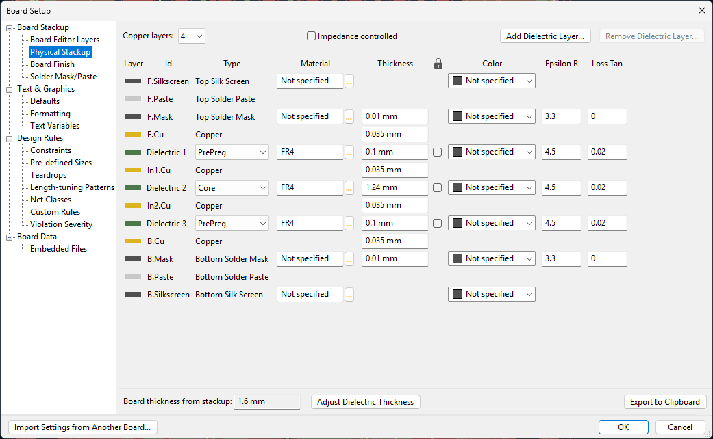

> **Constraints:**  
> 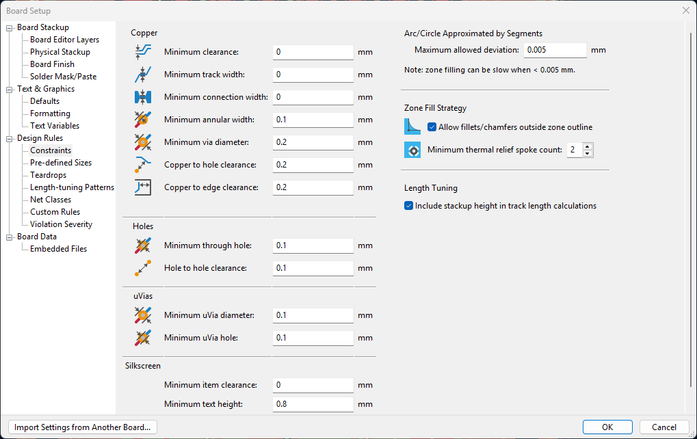

> **Violations:**  
> 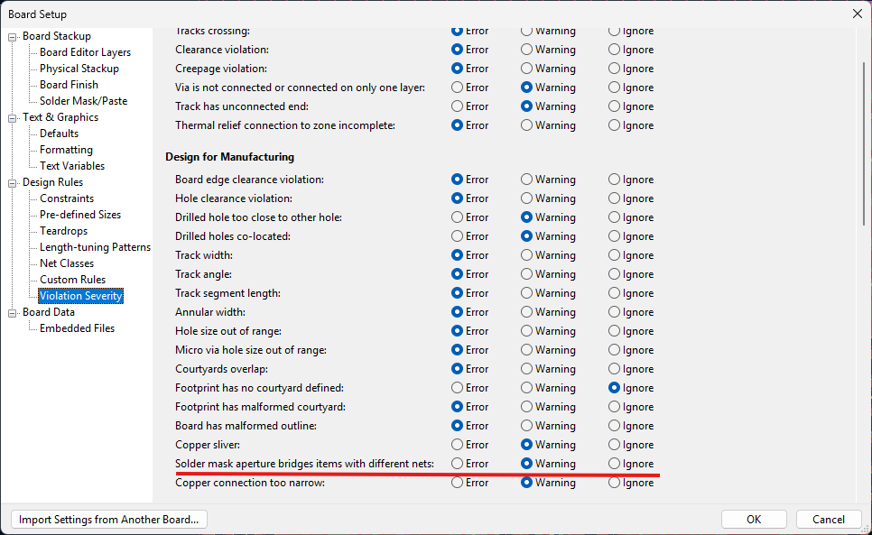

</details>

---

## 📐 งานที่ 2 — Schematic (ERC)

1. ไปที่ **Tools → Annotate Schematic** → Annotate All
2. เพิ่ม `PWR_FLAG` บน Net `VBUS` และ `+3V3`
3. รัน **Inspect → Electrical Rules Checker (ERC)**
4. แก้ไข Error ทุกรายการจนกว่าจะผ่าน **0 Errors**
5. บันทึก: `SCH_ERC_0Error.png` และ `SCH_Full.png`

> **ตัวอย่างผล ERC ที่ผ่าน:**  
> 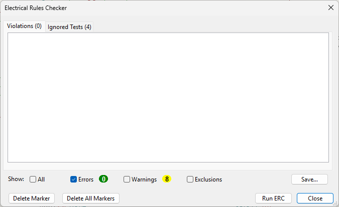

---

## 🖨️ งานที่ 3 — PCB Layout

### 📏 กำหนดขนาด Board

- วาด Outline บน Layer **Edge.Cuts** — Line Width: `0.05 mm`
- ขนาด Board: **20–35 mm × 20–35 mm**

> [!CAUTION]
> Board ที่มีขนาดเกิน **35×35 mm** ถือว่าไม่ผ่านเงื่อนไขขนาดบอร์ด

### 🏷️ เพิ่มชื่อและโลโก้ CE บน B.SilkS

**ขั้นตอนที่ 1 — พิมพ์ชื่อ (Text):**
1. เลือก Layer **B.SilkS** → กด `T`
2. พิมพ์ชื่อ-นามสกุลภาษาอังกฤษ เช่น `PHOORI` (ขนาด ≥ 3.0 mm)

**ขั้นตอนที่ 2 — นำเข้าโลโก้ CE:**
1. **Place → Add Image** (หรือ **File → Import → Bitmap Image**)
2. เลือกไฟล์โลโก้ → Layer **B.SilkS** → ปรับ Scale → วางบน Board

> **ตัวอย่างโลโก้ CE:**  
> 

> [!TIP]
> ใช้รูปโลโก้ CE ที่มี **พื้นหลังสีดำ ตัวอักษรสีขาว** เพื่อให้ KiCad แปลงเป็น Silkscreen ได้ถูกต้อง

---

## 🔌 งานที่ 4 — PCB Routing

### 🗃️ ตั้งค่า Net Classes

| Net Class | Net | Track Width | Clearance |
|:----------|:----|:-----------:|:---------:|
| `USB_DIFF` | USB_DP, USB_DM | 0.2 mm | 0.2 mm |
| `POWER` | VBUS, +3V3 | 0.5 mm | 0.3 mm |
| `Default` | ทุก Net อื่น | 0.2 mm | 0.2 mm |

> **ตัวอย่าง Net Classes:**  
> 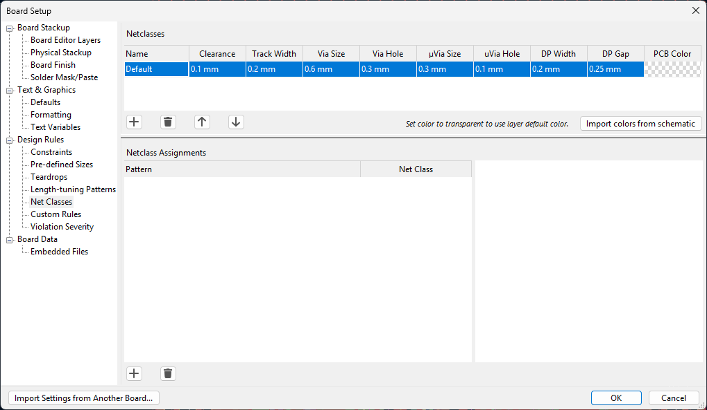

### 🧲 Copper Pour / Fill Zone (บังคับทุก Layer)

| Layer | Net |
|:------|:----|
| **F.Cu** | GND |
| **In1.Cu** | GND |
| **In2.Cu** | GND |
| **B.Cu** | GND |

**ขั้นตอน:**
1. เลือก Layer → **Place → Add Filled Zone** (`Ctrl+Shift+Z`)
2. วาด Zone ครอบ Board ภายใน Edge.Cuts
3. Zone Properties: Net = `GND`, Pad Connection = `Thermal Relief`
4. กด `B` เพื่อ **Fill All Zones**

> **ตัวอย่าง Zone Properties:**  
> 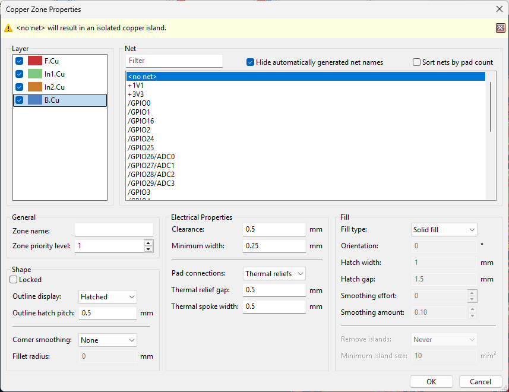

> [!CAUTION]
> ต้องมี Fill Zone **ครบทุก 4 Layer** มิฉะนั้นถือว่าไม่ผ่านเงื่อนไข GND Plane

---

## ✅ งานที่ 5 — DRC และ 3D View

### 🔍 Design Rule Check

1. **Inspect → Design Rules Checker → Run DRC**
2. แก้ไข Error จนผ่าน **0 Errors**
3. บันทึก Screenshot: `PCB_DRC_0Error.png`

> **ตัวอย่างผล DRC ที่ผ่าน:**  
> 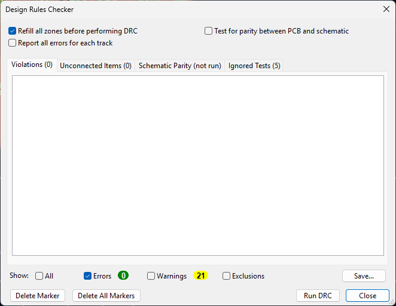

### 🧊 3D View

1. กด `Alt+3` หรือ **View → 3D Viewer**
2. ตรวจสอบว่า Component ทุกตัวมี 3D Model ครบ
3. บันทึกภาพ 2 มุม: `3D_Top.png` + `3D_Bottom.png`
4. บันทึก PCB Layout เพิ่ม: `PCB_Layout_Top.png` + `PCB_Layout_Bottom.png`

> [!CAUTION]
> Component ที่ไม่มี 3D Model ถือว่าไม่ผ่านเงื่อนไข

---

## 📬 สรุปการส่งงาน

<div align="center">

### 🔗 [คลิกที่นี่เพื่อส่งงาน](https://docs.google.com/forms/d/e/1FAIpQLSdr00fWbVABh_uF_Hmt_Hmi3ux_y0vmjzFsGliQYqPfY1zKxA/viewform?usp=dialog)

</div>

### 📁 ไฟล์ที่ต้องส่ง

```
StudentID_Exam.zip
├── StudentID_Exam.kicad_pro
├── StudentID_Exam.kicad_sch
└── StudentID_Exam.kicad_pcb

Screenshots_Schematic/
└── SCH_Full.png          ← ภาพรวม Schematic

Screenshots_PCB/
└── PCB_Full.png          ← ภาพรวม PCB

Screenshots_3D/
├── 3D_Top.png            ← มุมมองด้านบน
└── 3D_Bottom.png         ← มุมมองด้านล่าง
```

### 🖼️ ตัวอย่างผลงานที่ต้องส่ง

| Schematic | PCB Layout |
|:---------:|:----------:|
| 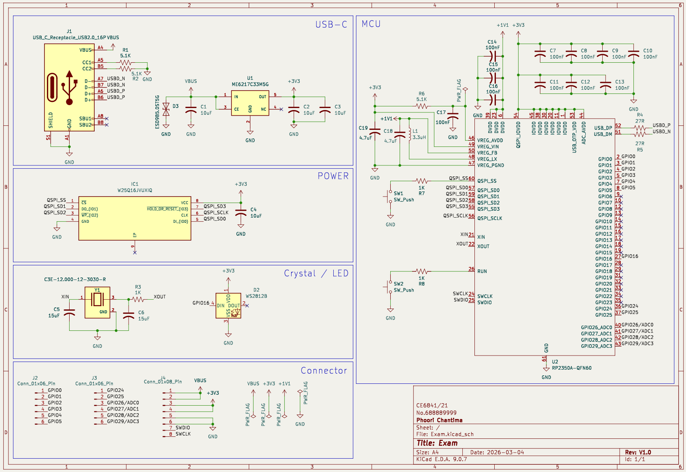 | 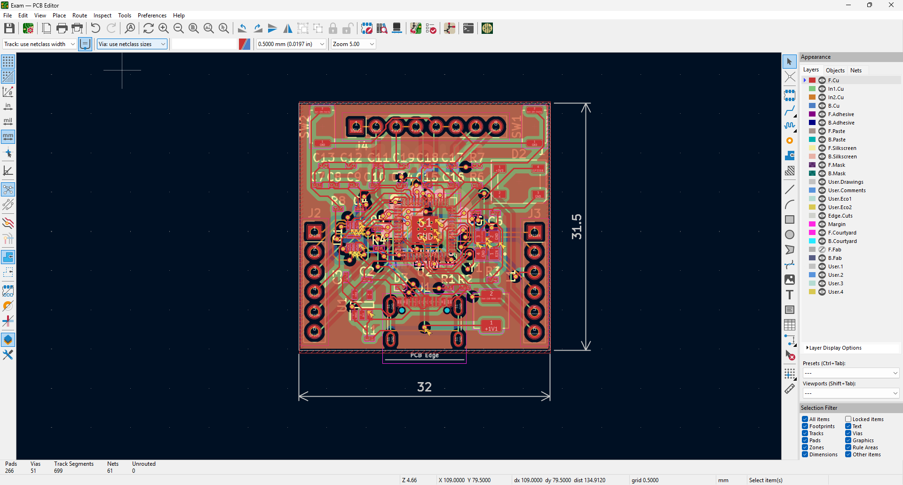 |

| 3D — Top | 3D — Bottom |
|:--------:|:-----------:|
| 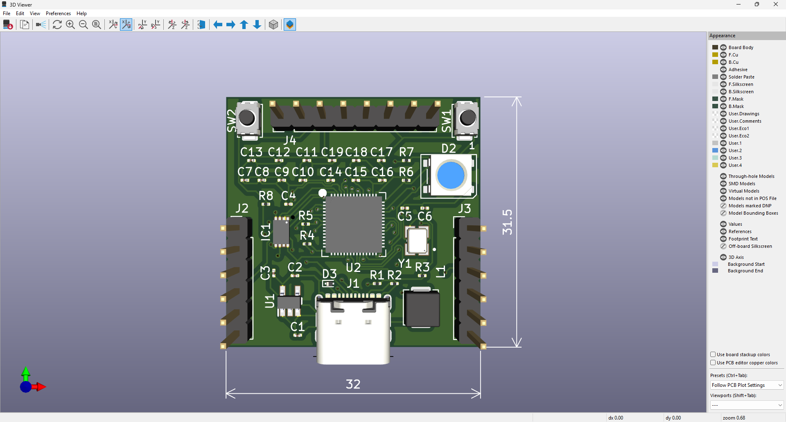 | 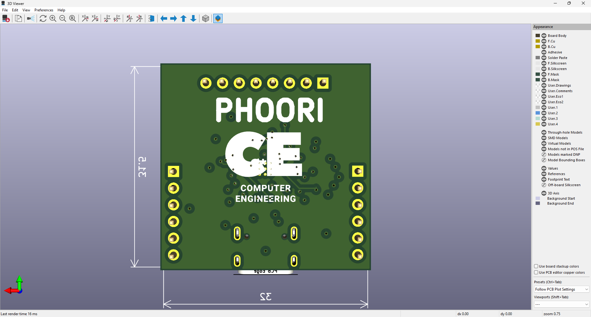 |

---

<div align="center">

*สอบปฏิบัติ KiCad | CE6841/21 | 4 มีนาคม 2026*

</div>
