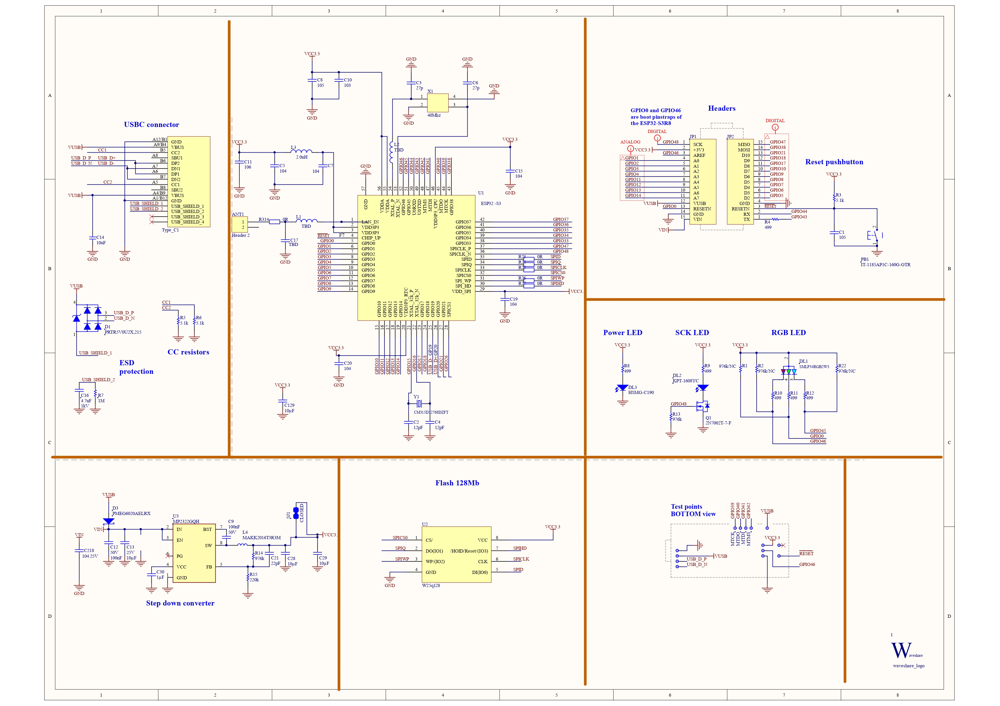

# KiCad Project

This repository contains resources and documentation for working with KiCad, an open-source software suite for electronic design automation (EDA).

## Structure
- **Material/**: Contains training and test materials for KiCad.
  - **imgs/**: Images and diagrams related to KiCad projects.
  - **Test/**: Test resources and documentation.
    - **README.md**: Information about test materials.
    - **imgs/**: Images for test cases.
  - **Trainnig/**: Training resources for learning KiCad.
    - **README.md**: Information about training materials.
    - **Libraries/**: Custom libraries for KiCad projects.

## Getting Started
1. **Install KiCad**: Download and install the latest version from [kicad.org](https://www.kicad.org/download/).
2. **Clone this repository**:
   ```sh
   git clone https://github.com/alfaXphoori/KiCad.git
   ```
3. **Explore Materials**: Review the contents in the `Material/` folder for training and testing resources.

## Documentation (PDFs)
- [KiCad Official Documentation](https://docs.kicad.org/)
- Training guides and tutorials (see `Material/Trainnig/`)
- Test cases and examples (see `Material/Test/`)

Add PDF files to relevant folders for easy reference and offline access.

## Images & Schematics


### Available Resources
- [ESP32-S3-Nano Schematic PDF](Material/imgs/ESP32-S3-Nano-Schematic.pdf)

## Contributing
Feel free to contribute by submitting issues or pull requests. Suggestions for new training materials, libraries, or test cases are welcome.

## License
This repository is licensed under the MIT License. See the LICENSE file for details.

## Contact
For questions or support, please open an issue in this repository.
