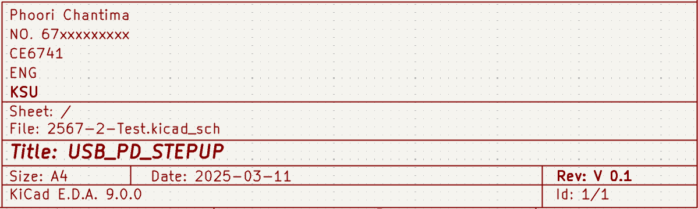
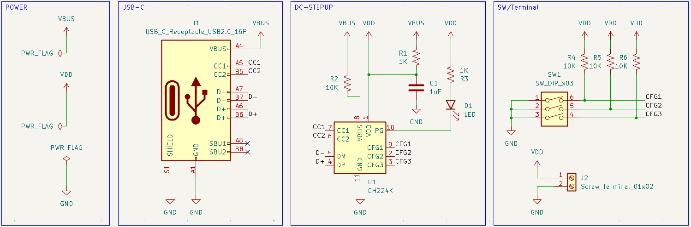
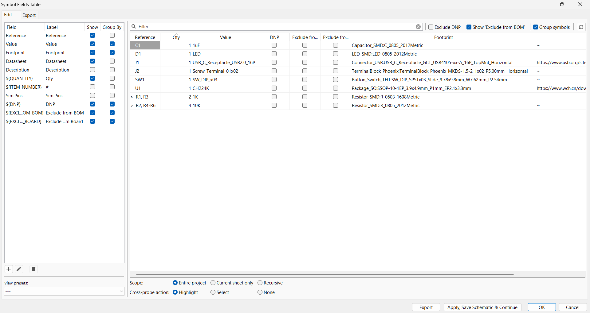
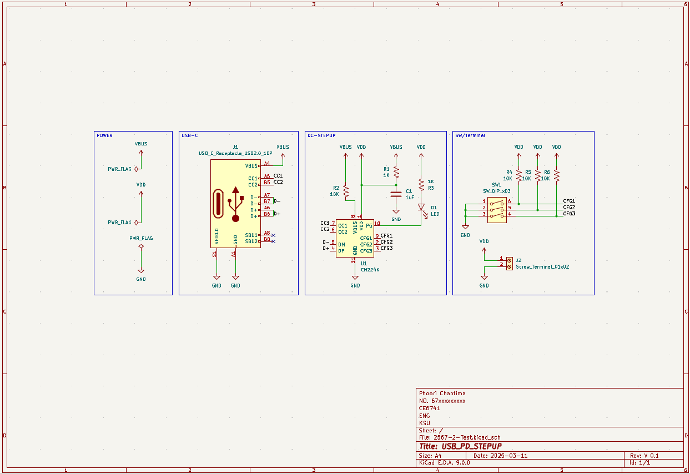
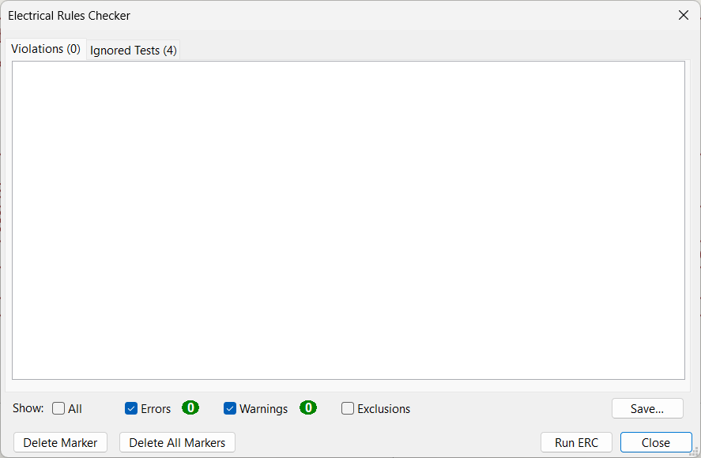

# 🚀 ข้อสอบปฏิบัติรายวิชาเขียนลายวงจรอิเล็กทรอนิกส์ด้วย KiCad 🛠️

## 📌 คำชี้แจง  
✅ ให้นักศึกษาดำเนินการออกแบบวงจรและแผ่น PCB ตามหัวข้อที่กำหนด  
💻 ใช้ **KiCad** เป็นซอฟต์แวร์หลักในการออกแบบ  
📜 ให้แนบ **ไฟล์โปรเจกต์, ภาพแคปหน้าจอ และ Gerber Files**  
✅ คะแนนเต็ม **20 คะแนน**  

---

## 🟢 1. สร้างโปรเจค  
📌 สร้างโปรเจคใหม่โดยใช้ชื่อ **CE67xx_Test_ชื่อนักศึกษา**  
**ตัวอย่าง:** `CE6741_Test_Phoori`  

---

## 🔵 2. ออกแบบ Schematic Diagram (7 คะแนน)  

### 📝 2.1 กำหนดข้อมูล Schematic  
- อ้างอิงตามรูปด้านล่าง  
  -   

### 📡 2.2 ต่อวงจรตามภาพตัวอย่าง  
-   

### 🔧 2.3 กำหนด Footprint ตาม BOM  
-   

### 🎯 2.4 เมื่อออกแบบสำเร็จควรได้ผลลัพธ์ดังนี้  
-   

### ✅ 2.5 ตรวจสอบ Electrical Rules Checker (ERC)  
- ตรวจสอบข้อผิดพลาดของวงจร  
-   

---

## 🔵 3. ออกแบบ PCB Layout (7 คะแนน)  
📌 ให้นักศึกษาทำการ  
- แปลงวงจรจาก **Schematic** เป็น **PCB Layout**  
- จัดเรียงอุปกรณ์และลากเส้น **Copper Trace** ให้เหมาะสม  
- ตรวจสอบข้อผิดพลาดด้วย **Design Rule Check (DRC)**  

---

## 🟠 4. การสร้างไฟล์สำหรับการผลิต (6 คะแนน)  

### 🏗 4.1 การส่งออก Gerber Files  
📌 ให้นักศึกษาส่งออกไฟล์สำหรับการผลิตดังนี้  
- **Top Layer, Bottom Layer, Drill File และ Silk Screen**  
- ตรวจสอบไฟล์ **Gerber** ด้วย **GerbView**  

📌 **ตัวอย่างไฟล์ที่ต้องส่ง:**  
✅ `Gerber.zip` (รวมทุกไฟล์ Gerber และ Drill File)  
✅ Screenshot ของไฟล์ Gerber ที่เปิดด้วย **GerbView**  

---

## ✅ จบข้อสอบ  

### 📌 หมายเหตุ:  
- นักศึกษาควรบันทึก **ไฟล์โครงการทั้งหมด** เป็น `.zip` เพื่อนำส่ง  
