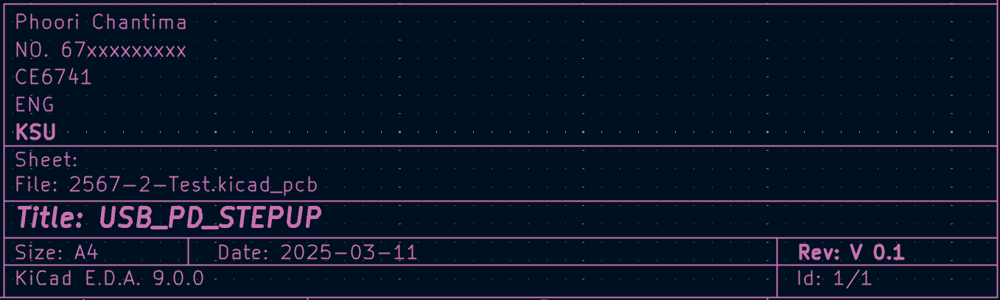
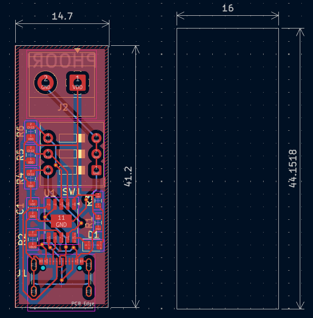
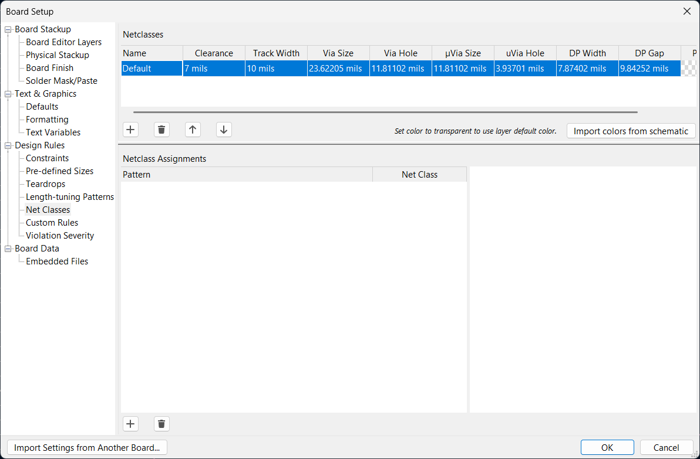
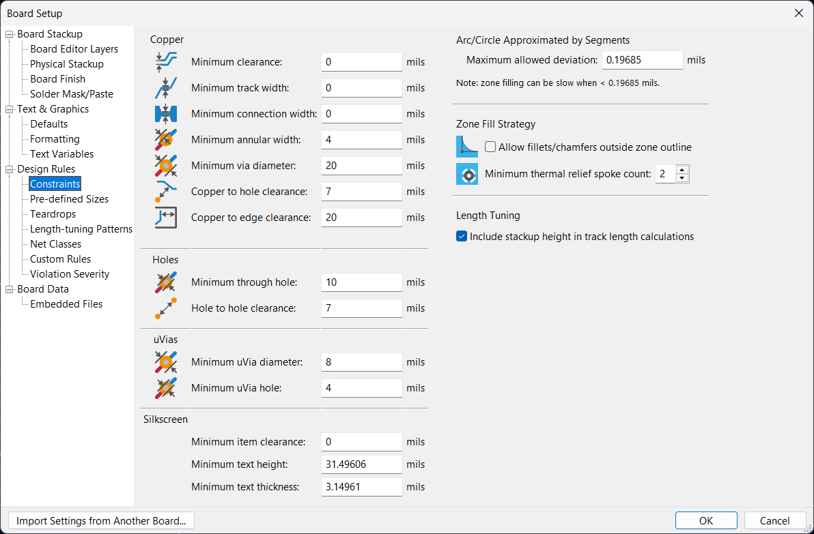
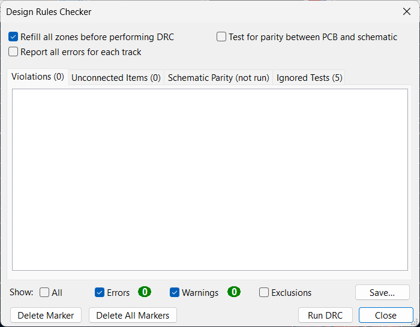
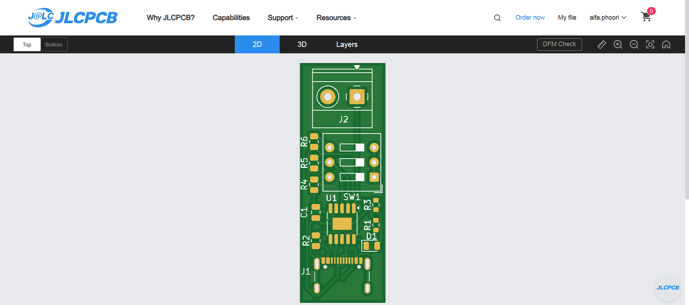
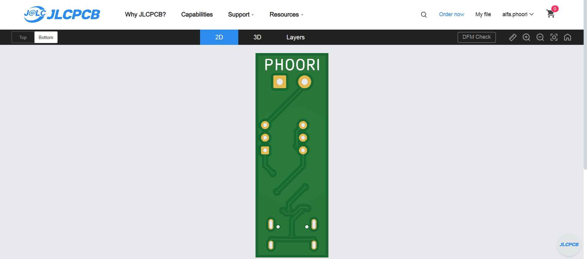

# 🚀 ข้อสอบปฏิบัติรายวิชาเขียนลายวงจรอิเล็กทรอนิกส์ด้วย KiCad 🛠️

## 📌 คำชี้แจง  
✅ ให้นักศึกษาดำเนินการออกแบบวงจรและแผ่น PCB ตามหัวข้อที่กำหนด  
💻 ใช้ **KiCad** เป็นซอฟต์แวร์หลักในการออกแบบ  
📜 ให้แนบ **ไฟล์โปรเจกต์, ภาพแคปหน้าจอ และ Gerber Files**  
✅ คะแนนเต็ม **20 คะแนน**  

---

## 🟢 1. สร้างโปรเจค  
📌 สร้างโปรเจคใหม่โดยใช้ชื่อ **CE67xx_Test_ชื่อนักศึกษา**  
**ตัวอย่าง:** `CE6741_Test_Phoori`  

---

## 🔵 2. ออกแบบ Schematic Diagram (7 คะแนน)  

### 📝 2.1 กำหนดข้อมูล Schematic  
- อ้างอิงตามรูปด้านล่าง  
  -   

### 📡 2.2 ต่อวงจรตามภาพตัวอย่าง  
-   

### 🔧 2.3 กำหนด Footprint ตาม BOM  
-   

### 🎯 2.4 เมื่อออกแบบสำเร็จควรได้ผลลัพธ์ดังนี้  
-   

### ✅ 2.5 ตรวจสอบ Electrical Rules Checker (ERC)  
- ตรวจสอบข้อผิดพลาดของวงจร  
-   
---

## 🔵 3. ออกแบบ PCB Layout (7 คะแนน)  
### 📝 3.1 กำหนดข้อมูล Schematic  
- 
### 3.2 กำหนดให้นักศึกษา กำหนดขนาด ผ่าน PCB ไม่เกิน 16mm x 45mm
- 
### 3.3 กำหนดขนาดเส้น ดังต่อไปนี้
- 
### 3.4 Draw filled zone และ เพิ่มชื่อ นักศึกษา B.Silkscreen ดังภาพ 
- 
### 3.5 กำหนดค่าการตรวจเช็ค และตรวจสอบ ความถูกต้อง
- 
- 

---

## 🟠 4. การสร้างไฟล์สำหรับการผลิต JLCPCB (6 คะแนน)  

### 🏗 4.1 การส่งออก Gerber Files 
### 4.2 สั่งผลิต JLCPCB ด้วยใช้ Gerber Files 
- 
- 

---

## ✅ จบข้อสอบ  
